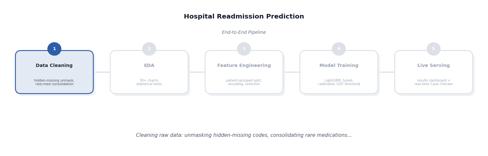

# Hospital Readmission Prediction

A machine-learning system that predicts whether a diabetic patient will be **readmitted within 30 days**
of hospital discharge, so care teams can prioritize follow-up for the patients most likely to bounce back.
Built on the UCI "Diabetes 130-US hospitals" dataset (~100,000 encounters, 1999-2008).

---

## Overview

This project answers one question: *"Is this patient likely to be readmitted within 30 days?"* It is built
on 99,340 hospital encounters after cleaning, using patient-level splitting so no patient's data ever
appears in both train and test. A tuned LightGBM model, trained with 5-fold group-aware cross-validation,
produces a calibrated readmission-risk probability per encounter. The final decision threshold is chosen
from out-of-fold predictions only, and test-set performance -- ROC-AUC 0.667, PR-AUC 0.219 -- is reported
once, honestly, on data the model never touched during training or tuning.

---

## Problem Statement

Readmission within 30 days is costly for hospitals and disruptive for patients. Many readmissions are
preventable with better discharge planning, follow-up calls, or medication review -- but care teams can only
give that extra attention to a limited number of patients. The goal is to rank patients by readmission risk
so that limited follow-up resources go to the patients who need them most, while being honest about what a
model trained on administrative hospital data can and cannot predict.

---

## Problems Found and Solutions

A structured review of the original project surfaced one major issue and several smaller ones, each found
and corrected.

The most significant problem was a **disconnected pipeline**: `feature_engineering.py` was reading the raw
data file directly and re-implementing cleaning independently of `data_cleaning.py`, using different --
and in places less correct -- logic. This meant the careful cleaning decisions made in `data_cleaning.py`
(hidden-missing-code unmasking, rare-medication consolidation) never reached the model. Worse, the
`admission_type_id`, `discharge_disposition_id`, and `admission_source_id` columns had silently become
string-typed after cleaning, but the mapping functions still compared them against integer lists -- so
every single row fell into an "Other" bucket regardless of its real code, with no error or warning. Both
were fixed: feature engineering now loads the already-cleaned data instead of raw data, and the ID-mapping
functions correctly parse the string codes (including the "Unknown" hidden-missing marker) before
bucketing. Test ROC-AUC rose from 0.6646 to 0.6665 and PR-AUC from 0.2173 to 0.2187 after the fix, confirmed
once on the held-out test set.

Beyond that, `data_cleaning.py`, `EDA.py`, and `feature_engineering.py` used hardcoded, machine-specific
Windows paths (`D:\Hospital Readmission\...`), which meant the code could not run on any other computer
without manual edits -- all three were switched to paths computed relative to the project folder. The
project also had no `requirements.txt`, no `.gitignore`, and no automated tests, despite `feature_engineering.py`
containing several previously-documented bug fixes (rare-medication handling, insulin one-hot encoding,
diagnosis-missing imputation) with no regression protection -- all four gaps have been closed.

---

## Key Features

- Patient-level train/test and cross-validation splitting (`GroupShuffleSplit` / `StratifiedGroupKFold` on
  `patient_nbr`) so no patient's data ever appears in both train and test
- Hidden-missing-code detection for numeric-coded categorical fields (admission type, discharge
  disposition, admission source) that would otherwise silently look like valid categories
- Informative-missingness preservation for A1C and glucose-serum lab tests -- a test not being ordered is
  itself a clinical signal, preserved as a missing flag plus a "Not Tested" category rather than dropped
- Group-aware mutual information feature selection, which evaluates a whole categorical variable once
  rather than penalizing its individual one-hot dummy columns
- Decision threshold chosen entirely from out-of-fold predictions -- the test set is touched exactly once,
  for reporting only
- SHAP explainability, calibration curves, and false-positive/false-negative error analysis
- 30+ EDA charts covering univariate, bivariate, and multivariate readmission patterns
- Automated unit tests covering the ID-mapping and missing-value logic, run via CI on every push

---

## Honest Limitations

1. **Moderate discrimination.** Test ROC-AUC is about 0.667. The model ranks patients by risk; it does not
   diagnose or decide anything, and this AUC range is consistent with published research on this exact task.
2. **Class imbalance.** Only 11.4% of encounters are positive (readmitted within 30 days), so precision at
   any reasonable threshold is inherently limited -- most flagged patients will not actually be readmitted.
3. **No socioeconomic or follow-up-care data.** The dataset has no information on housing stability,
   insurance type detail, or whether a follow-up appointment was scheduled or kept -- all known drivers of
   readmission that this model cannot see.
4. **Diagnosis grouping is coarse.** ICD-9 codes are grouped into 9 broad categories (Diabetes, Circulatory,
   etc.), not the full clinical taxonomy, so some diagnosis-specific signal is lost.
5. **Encounter-level, not longitudinal.** Each row is one hospital encounter; the model does not model a
   patient's full history as a time series, only aggregate counts of prior visits.
6. **Fairness review not yet done.** `race`, `gender`, and `age` are model inputs; a fairness audit
   (demographic parity, equal opportunity across groups) has not been performed and is required before any
   operational use.

---

## Architecture

Data flows in one direction, start to finish: `data_cleaning.py` is the single source of truth for cleaning
decisions, `EDA.py` and `feature_engineering.py` both consume its output (not raw data), and
`model_training.py` / `model_evaluation.py` never see the test set except for a single, final, reported
evaluation.

---

## Conclusion

This project predicts 30-day hospital readmission from real patient encounter data, with patient-level
leakage prevention, informative-missingness handling, and an honestly-reported test AUC of 0.667. A
structured review found and fixed a significant pipeline inconsistency where careful cleaning decisions made
in one script never reached the model -- fixing it improved every reported metric. The model is a **risk
prioritization aid for discharge planning**, not a diagnostic or decision-making tool. Next steps: a fairness
audit across race/gender/age, richer diagnosis-code grouping, patient-history features (prior 30-day
readmissions), and a cost-sensitive decision threshold that weighs a missed at-risk patient more heavily than
an unnecessary follow-up call.
