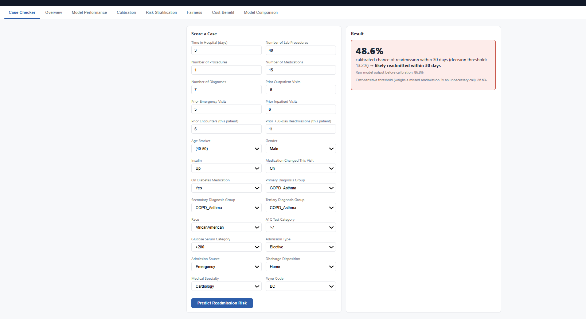
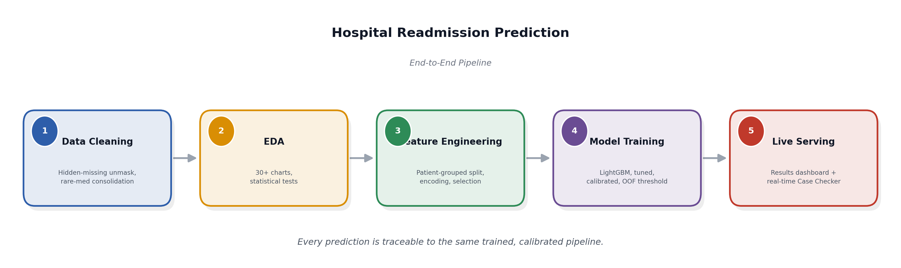

# Hospital Readmission Prediction

## Screenshots

**Case Checker** -- describe a patient's encounter and get the real model's calibrated 30-day
readmission risk, the decision threshold, and the cost-sensitive threshold side by side.

---

## Overview

This project answers one question: *"Is this patient likely to be readmitted within 30 days?"* It is
built on 99,340 hospital encounters, using patient-level splitting so no patient's data ever appears in
both train and test. A tuned, calibrated LightGBM model produces a readmission-risk probability per
encounter, served live through a results dashboard and a real-time Case Checker.

---

## Aim

- Predict whether a diabetic patient will be readmitted within 30 days of discharge
- Rank patients by risk so care teams can prioritize follow-up for those most likely to bounce back
- Keep every reported probability honestly calibrated (a "60%" case really means about 60%)
- Score any new patient encounter live through a real-time Case Checker
- Present model performance, fairness, and cost-benefit results through one dashboard

---

## Benefits

- **Better prioritization** -- limited follow-up resources go to the patients who need them most
- **Trustworthy probabilities** -- calibration is checked and corrected, so risk scores can be used at
  face value, not just for ranking
- **Live scoring** -- any new patient encounter can be scored instantly through the Case Checker, using
  the exact same pipeline as training
- **Cost-aware decisions** -- a cost-sensitive threshold reflects that missing an at-risk patient is more
  costly than an unnecessary follow-up call
- **Fairness screening** -- selection rates and recall are checked across gender and race groups
- **Clear business case** -- a cost-benefit simulation shows the potential savings from outreach to
  high-risk patients

---

## Key Features

- Patient-level train/test and cross-validation splitting so no patient's data ever leaks between sets
- Hidden-missing-code detection and informative-missingness preservation for lab tests
- Patient-history features (prior encounters and prior readmissions for that patient)
- Refined, clinically grouped diagnosis categories
- Platt-calibrated probabilities, verified with an Expected Calibration Error check
- Both an F1-optimal and a cost-sensitive decision threshold
- Live **Case Checker** -- score any real patient encounter with the actual trained model
- Fairness audit, risk stratification (Low/Medium/High), and a cost-benefit simulation
- SHAP explainability, calibration curves, and error analysis
- One-command results dashboard; every number shown comes from the real model, not a static demo

---

## Architecture

Data flows in one direction, start to finish: `data_cleaning.py` is the single source of truth for
cleaning decisions, `feature_engineering.py` consumes its output, `model_training.py` trains, calibrates,
and selects thresholds using only out-of-fold predictions, and the live Case Checker reuses the exact same
saved pipeline artifacts for every new prediction.
